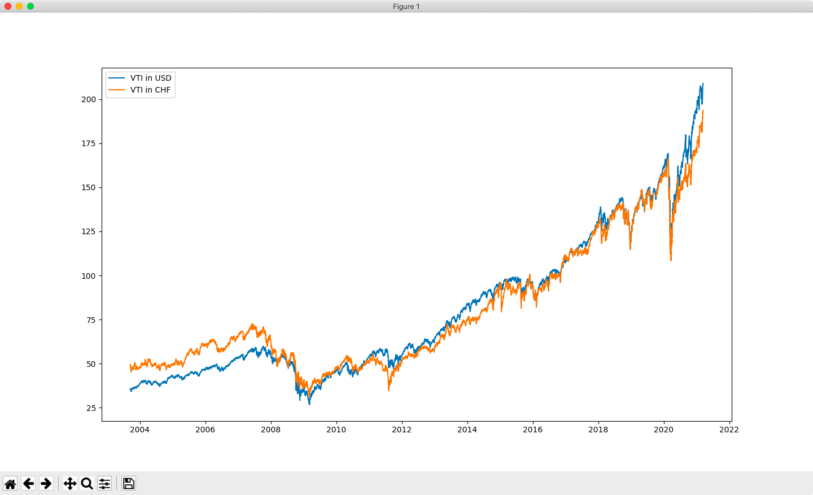

Plotting Yahoo Finance data in different currencies
===================================================

Yahoo Finance displays ETFs like Vanguard [VTI](https://yhoo.it/3emWbmu) in USD, I wanted to see if the charts looked quite so exciting if one converted to CHF.

Python setup
-----------

Make sure you're version of Python includes `tkinter`:

```
$ python -m tkinter
```

You should see a small demo `tkinter` window whizz around. If not, see [here](https://github.com/george-hawkins/snippets/blob/master/install-python.md#tkiniter).

Set up a project directory and `venv`:

```
$ mkdir financials
$ cd financials
$ python3 -m venv env
$ source env/bin/activate
(env) $ pip install --upgrade pip
```

Install Pandas and other packages
---------------------------------

Install the packages that we'll be using:

```
(env) $ pip install pandas matplotlib yfinance
```

Try out `matplotlib` via the Python prompt:

```
$ python
>>> import matplotlib
>>> matplotlib.use("TkAgg")
>>> import matplotlib.pyplot as plt
>>> plt.ion()
>>> plt.plot([1.6, 2.7])
```

You should see a simple straight line chart.

Note: by default `matplotlib` uses the `macosx` backend on MacOS. This didn't work by default for me and I didn't investigate why - I just switched to using `TkAgg` instead (as seen above).

For more on backends, see [here](https://matplotlib.org/stable/tutorials/introductory/usage.html?highlight=tkagg#backends).

Plotting Tesla close price
-------------------------

Let's go on and plot Tesla:

```
>>> import yfinance as yf
>>> tsla_ticker = yf.Ticker("TSLA")
>>> tsla_df = tsla_ticker.history(period="max")
>>> tsla_df["Close"].plot()
```

For whatever reason the graph goes from 1970 even though the data only goes from 2010.

Plotting the Dow, SPY and Vanguard VTI
--------------------------------------

OK - let's look at Vanguard VTI:

```
>>> vti_ticker = yf.Ticker("VTI")
>>> vti_df = vti_ticker.history(period="max")
>>> vti_df.head()
                 Open       High        Low      Close  Volume  Dividends  Stock Splits
Date                                                                                   
2001-06-15  38.492697  38.895508  38.319072  38.659378  1067400        0.0           0.0
2001-06-18  38.763555  38.833007  38.412834  38.412834   282600        0.0           0.0
...
>>> vti_df.tail()
vti_df.tail()
                 Open       High        Low      Close   Volume  Dividends  Stock Splits
Date                                                                                    
...
2021-03-05  199.369995  201.210007  194.110001  200.750000  6612900        0.0           0.0
2021-03-08  201.440002  202.875000  200.220001  201.869995  3354933        0.0           0.0
```

OK - so VTI runs from 2001-06-15 to 2021-03-08, I know that's much shorter than the history available for ^DJI and SPY. Let's fetch them as well:

```
>>> dji_ticker = yf.Ticker("^DJI")
>>> dji_df = dji_ticker.history(period="max")
>>> spy_ticker = yf.Ticker("SPY")
>>> spy_df = spy_ticker.history(period="max")
```

By default `matplotlib` uses the same window (what it calls a figure) but let's create three figures and plot VTI, ^DJI and SPY for the time period for which we have VTI data:

```
>>> plt.figure(1)
>>> dji_df.loc["2001-06-15":]["Close"].plot(title="^DJI")
>>> plt.figure(2)
>>> spy_df.loc["2001-06-15":]["Close"].plot(title="SPY")
>>> plt.figure(3)
>>> vti_df["Close"].plot(title="VTI")
```

`plt.figure(1)` introduces figure `1` and `matplotlib` will use it until you introduce another figure. To switch back to using an existing figure just use `figure` again, e.g. to flip back to using `2`:

```
>>> plt.figure(2)
```

I added `title="xyz"` as an argument to the `plot` calls above - it makes it easier to keep track of what's being plotted in each window.

So does VTI look more like ^DJI or SPY? I'd say SPY. So let's work with it as it has a longer time series.

A quick aside
-------------

Note: if you quit out of Python, you can use the script [`spy-dji-vti.py`](spy-dji-vti.py) to get back to this state:

```
(env) $ python
>>> exec(open("spy-dji-vti.py").read())
```

If you want to see a history of commands in the Python shell:

```
>>> import readline; print('\n'.join([readline.get_history_item(i + 1) for i in range(readline.get_current_history_length())]))
```

Adjust to CHF
-------------

Let's try adjusting to CHF, first let's get the USD/CHF time series:

```
>>> usdchf_ticker = yf.Ticker("USDCHF=X")
>>> usdchf_df = usdchf_ticker.history(period="max")
>>> usdchf_df.head()
              Open    High     Low   Close  Volume  Dividends  Stock Splits
Date                                                                       
2003-09-17  1.3814  1.3840  1.3743  1.3807       0          0             0
2003-09-18  1.3802  1.3868  1.3747  1.3858       0          0             0
...
```

That's disappointing - our USD/CHF data goes back even less far than the VTI data. OK - then let's just work with VTI (and forget about SPY).

At this point I became a bit confused as to what I was getting using `loc` and the slice-like notation - you don't actually get further data frames:

```
>>> type(usdchf_df)
<class 'pandas.core.frame.DataFrame'>
>>> type(usdchf_df.loc["2003-09-17":]["Close"])
<class 'pandas.core.series.Series'>
```

If you want to convert these series into frames you have to additionally use `to_frame`, so with that in mind let's get going and create frames consisiting of the same time period and just the closes:

```
>>> vti_close_df = vti_df.loc["2003-09-17":]["Close"].to_frame()
>>> usdchf_close_df = usdchf_df.loc["2003-09-17":]["Close"].to_frame()
```

Let's add the USD/CHF values as a new `rate` column in our VTI closes frame:

```
>>> vti_close_df["rate"] = usdchf_close_df
>>> vti_close_df
                 Close     rate
Date                           
2003-09-17   35.364235  1.38070
2003-09-18   35.811893  1.38580
2003-09-19   35.682980  1.36690
2003-09-22   35.274715  1.35280
2003-09-23   35.471672  1.35870
...                ...      ...
2021-03-02  203.289993  0.91490
2021-03-03  200.360001  0.91500
2021-03-04  197.190002  0.91970
2021-03-05  200.750000  0.92928
2021-03-08  201.019196  0.93540

[4398 rows x 2 columns]
```

OK - we've successfully added in a rate column - impressive to see how the dollar has fallen over this period, in 2003 1 USD got you 1.38 CHF, now 1 USD gets you 0.93 CHF.

Let's create a new `chf` column that applies that rate:

```
>>> vti_close_df["chf"] = vti_close_df["Close"] * vti_close_df["rate"]
>>> vti_close_df
                 Close     rate         chf
Date                                       
2003-09-17   35.364235  1.38070   48.827399
2003-09-18   35.811893  1.38580   49.628122
2003-09-19   35.682980  1.36690   48.775064
2003-09-22   35.274715  1.35280   47.719635
2003-09-23   35.471672  1.35870   48.195362
...                ...      ...         ...
2021-03-02  203.289993  0.91490  185.990016
2021-03-03  200.360001  0.91500  183.329405
2021-03-04  197.190002  0.91970  181.355650
2021-03-05  200.750000  0.92928  186.552957
2021-03-08  201.019196  0.93540  188.033357

[4398 rows x 3 columns]
```

Note: if the rate had been expressed as CHF/USD, rather than USD/CHF, we'd obviously have divided rather than multiplied just there.

Let's plot the result:

```
>>> plt.figure(4)
>>> vti_close_df["chf"].plot(title="VTI in CHF")
```

You can see that the graph looks different from "VTI in USD" but not as dramatically different as I expected. We can plot them on the same figure:

```
>>> plt.figure(5)
>>> vti_close_df["chf"].plot(label="VTI in CHF")
>>> vti_close_df["Close"].plot(label="VTI in USD")
>>> plt.legend()
```

Note that we can do the same with a little more explicit control, i.e. an explicit figure and axes subplot:

```
>>> fig, ax = plt.subplots()
>>> ax.plot(vti_close_df.index, vti_close_df["Close"], label="VTI in USD")
>>> ax.plot(vti_close_df.index, vti_close_df["chf"], label="VTI in CHF")
>>> ax.legend()
```

And the results:


